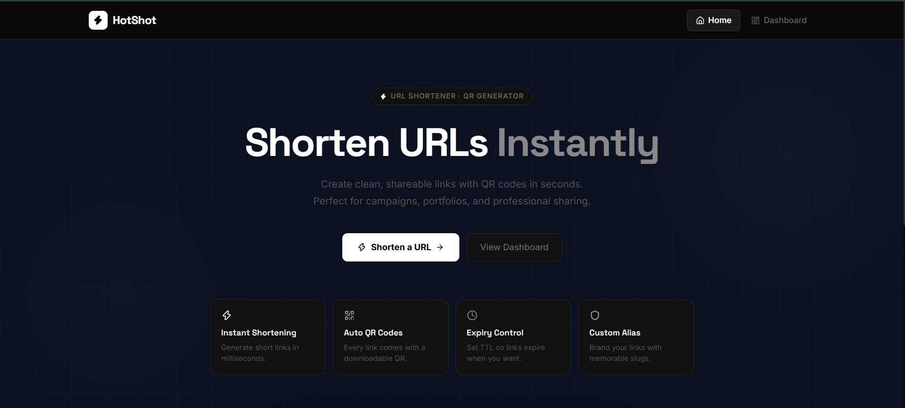
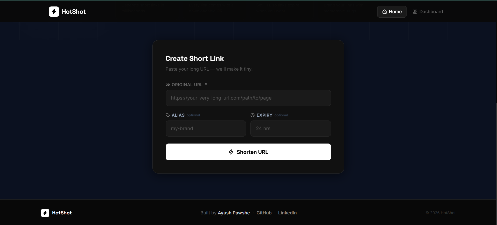
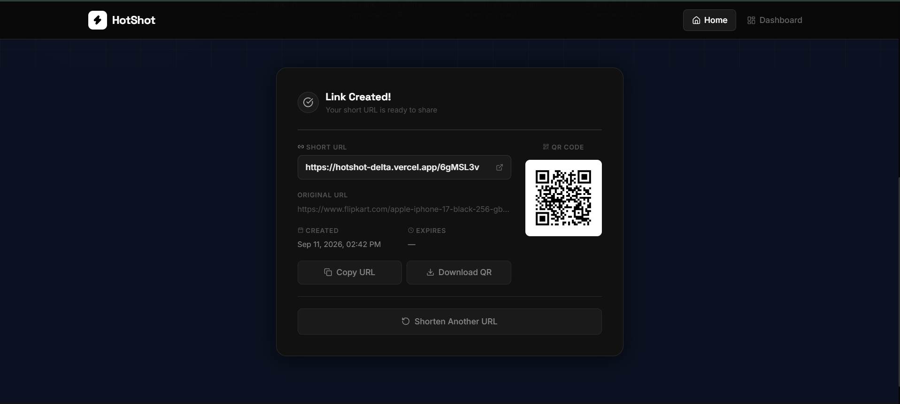
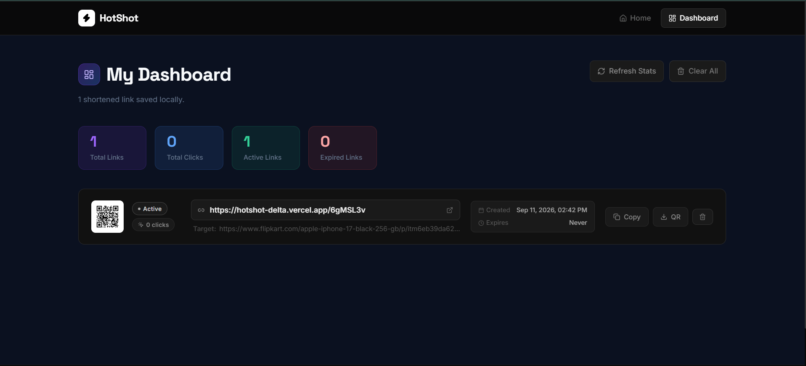

# HotShot

**HotShot is a fast URL shortener with built-in QR codes, custom aliases, expiry control, and a clean local dashboard.**

Use it to turn long links into short, shareable URLs for portfolios, campaigns, product links, and quick professional sharing.

**Live app:** [hotshot-delta.vercel.app/dashboard](https://hotshot-delta.vercel.app/dashboard)



## Highlights

- **Shorten links instantly** with a simple, focused form.
- **Create custom aliases** for memorable branded links.
- **Set optional expiry times** so links stop working when you want.
- **Generate QR codes automatically** for every short URL.
- **Track clicks** from the dashboard.
- **Save links locally** in the browser for quick access.
- **Copy short links** and **download QR codes** from the result view or dashboard.

## Preview

| Create a link | Link result |
| --- | --- |
|  |  |

| Dashboard |
| --- |
|  |

## Tech Stack

- **Frontend:** React, Vite, React Router, Tailwind CSS, Axios, Lucide React
- **Backend:** FastAPI, Uvicorn, Pydantic
- **QR codes:** `qrcode[pil]`
- **Frontend deployment:** Vercel
- **Backend deployment:** Render

## Project Structure

```text
HotShot/
├── Backend/
│   ├── main.py
│   ├── requirements.txt
│   ├── Dockerfile
│   ├── routes/
│   │   └── url_route.py
│   ├── schema/
│   │   └── url_schema.py
│   └── utils/
│       ├── qr_generator.py
│       └── shortcode.py
├── frontend/
│   ├── package.json
│   ├── vite.config.js
│   ├── vercel.json
│   └── src/
│       ├── App.jsx
│       ├── pages/
│       ├── components/
│       ├── hooks/
│       └── services/
└── docs/
    └── screenshots/
```

## Quick Start

Follow these steps to run HotShot on your computer.

### 1. Clone the repository

```bash
git clone <your-repository-url>
cd HS
```

### 2. Start the backend

Open a terminal in the project root and run:

```bash
cd Backend
python -m venv .venv
```

Activate the virtual environment:

```bash
# Windows PowerShell
.\.venv\Scripts\Activate.ps1
```

```bash
# macOS or Linux
source .venv/bin/activate
```

Install dependencies and start the API:

```bash
pip install -r requirements.txt
uvicorn main:app --reload
```

The backend will run at:

```text
http://localhost:8000
```

### 3. Start the frontend

Open a second terminal in the project root and run:

```bash
cd frontend
npm install
npm run dev
```

The frontend will run at:

```text
http://localhost:5173
```

## Environment Variables

### Frontend

Create `frontend/.env` if your backend is not running on `http://localhost:8000`.

```env
VITE_API_BASE_URL=http://localhost:8000
```

### Backend

Set `FRONTEND_URL` in production so generated short links use the public frontend domain.

```env
FRONTEND_URL=https://hotshot-delta.vercel.app
```

`BASE_URL` is also supported as a fallback.

## API Routes

### Health check

```http
GET /
```

Returns:

```json
{
  "message": "API is running"
}
```

### Create a short URL

```http
POST /url
```

Request body:

```json
{
  "original_url": "https://example.com/very/long/link",
  "custom_alias": "my-link",
  "expiry_hours": 24
}
```

Response:

```json
{
  "short_url": "https://hotshot-delta.vercel.app/my-link",
  "qr_code_path": "...",
  "clicks": 0,
  "created_at": "2026-09-11T14:42:00",
  "expired_at": "2026-09-12T14:42:00"
}
```

### Get link stats

```http
GET /url/stats/{shortcode}
```

### Redirect to original URL

```http
GET /{shortcode}
```

Redirects to the saved original URL and increments the click count.

## Deployment Notes

### Frontend on Vercel

The frontend includes `frontend/vercel.json` with rewrites for:

- `/` and `/dashboard` to the React app
- `/:shortcode` to the deployed FastAPI backend

Before deploying, set:

```env
VITE_API_BASE_URL=https://your-backend-url
```

### Backend on Render

The backend includes a `Dockerfile`, so it can be deployed as a Docker-based web service.

Set this environment variable on Render:

```env
FRONTEND_URL=https://hotshot-delta.vercel.app
```

## Important Notes

- The backend currently stores links in memory, so links reset when the server restarts.
- The dashboard stores saved links in the browser's `localStorage`.
- For production use, add a database such as PostgreSQL, MongoDB, Redis, or Supabase.

## Scripts

Run these commands from the `frontend` folder.

```bash
npm run dev      # Start the local frontend
npm run build    # Build the frontend for production
npm run preview  # Preview the production build
npm run lint     # Run ESLint
```

Run this command from the `Backend` folder.

```bash
uvicorn main:app --reload
```

## Author

Built by **Ayush Pawshe**.
